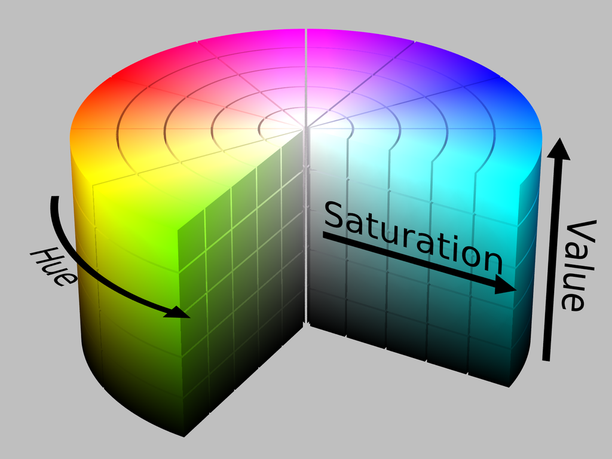
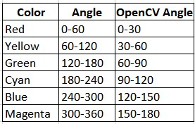
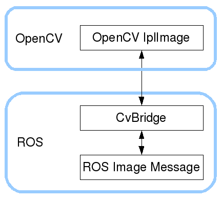

# ROS Basics

Author: __*yufanana*__

This documentation was produced from the ROS for Beginners: Basics, Motion and OpenCV course by Anis Koubaa available on udemy.com.
</br>
____

## Table of Contents <a name="top"></a>

 1. [ROS Concepts](#1)<br>
    1.1 [Publisher/Subscriber](#1.1) <br>
    1.2 [ROS Services](#1.2) <br>
    1.3 [ROS ActionLib](#1.3) <br>
    1.4 [ROS Computation Graph](#1.4) <br>
    1.5 [ROS Limitations](#1.5) <br>
    1.6 [ROS Benefits](#1.6) <br>
2. [Set Up](#2) <br>
    2.1 [Installation](#2.1) <br>
    2.2 [Workspace](#2.2) <br>
    2.3 [Packages](#2.3) <br>
    2.4 [Launch Files](#2.4) <br>
    2.5 [ROS Network Configuration](#2.5) <br>
3. [ROS Messages](#3) <br>
    3.1 [ROS Nodes](#3.1) <br>
    3.2 [Computation Graph](#3.2) <br>
    3.3 [Message Definition](#3.3) <br>
    3.4 [Create Publisher/Subscriber Files](#3.4) <br>
    3.5 [Custom Messages](#3) <br>
4. [ROS Services](#4) <br>
    4.1 [General](#4.1) <br>
    4.2 [Commands](#4.2) <br>
    4.3 [Custom ROS Service: Add 2 Integers](#4.3) <br>
5. [ROS Motion](#5) <br>
    5.1 [Motion Types](#5) <br>
    5.2 [Implementation](#5) <br>
6. [Computer Vision with OpenCV](#6) <br>
    6.1 [Applications](#6.1) <br>
    6.2 [OpenCV](#6.2) <br>
    >   6.2.1 [Executing Python Files](#6.2.1) <br>
        6.2.2 [Open/Save Image](#6.2.2) <br>
        6.2.3 [Image Encoding](#6.2.3) <br>
        6.2.4 [Video Stream Input](#6.2.4) <br>
        6.2.5 [Drawing](#6.2.5) <br>
        6.2.6 [Thresholding](#6.2.6) <br>
        6.2.7 [Color Filtering](#6.2.7) <br>
        6.2.8 [Tennis Ball Example](#6.2.8) <br>
        6.2.9 [Contour Detection](#6.2.9) <br>

    6.3 [OpenCV with ROS](#6.3) <br>
    >  6.3.1 [CV Bridge](#6.3.1) <br>
       6.3.2 [C++ Implementation](#6.3.2) <br>
7. [Laser Range Finders](#7) <br>
    7.1 [Applications](#7.1) <br>
    7.2 [Connecting RGBD Camera](#7.1) <br>
    7.3 [ROS Visualisation (RViz)](#7.2) <br>
    7.4 [C++ Implementation](#7.3) <br>
8. [ROS Serial](#8.1) <br>
    8.1 [rosserial_arduino](#8.1) <br>
    8.2 [rosserial_python](#8.2) <br>
    8.3 [rosserial_server](#8.3) <br>
    8.4 [serial_node](#8.4) <br>
    8.5 [rosserial Publisher](#8.5) <br>
    8.6 [rosserial Subscriber](#8.6) <br>
9. [ROS Navigation](#9) <br>

__Quick Tips for Terminal Command__<br>
After entering a keyword, *double tab* to view all the possible commands.

## Section 1: ROS Concepts <a name="1"></a>
[Go to top](#top)

There are 3 communication patterns. <br>
TCPROS layers are established between the nodes with the help of the master node before communication can begin.

### 1.1 Publisher/Subscriber <a name="1.1"></a>
[Go to top](#top)

Publisher ->  (topic) -> Subscriber </br>
It supports 1:N, N:1, N:N </br>
Possible topics: location (x, y, theta), obstacle (x, y), temperature, pressure.

E.g. multiple nodes require images from a camera.

### 1.2 ROS Services <a name="1.2"></a>
[Go to top](#top)

Client -> (service request) -> Server </br>
Server -> (responds to service) -> Client </br>
This is synchronous.

### 1.3 ROS ActionLib <a name="1.3"></a>
[Go to top](#top)

Client -> (action goal) -> Server </br>
Server -> (action feedback) -> Client (while waiting) </br>
Server -> (action result) -> Client (when done) </br>
This is asynchronous, clients can do other stuff while waiting.

E.g. move base, navigation step.

### 1.4 ROS Computation Graph <a name="1.4"></a>
[Go to top](#top)

ROS is composed of different nodes. Nodes can communicate with other nodes via messages (topics, services, actions, parameters). 

Each node can be a 
- publisher/subscriber
- service server/service client
- action server/action client

__roscore__ is the master node. It has to be started all the time. ROS is like a network inside a local machine. If the master node crashes, the other nodes may still be able to continue communicating.

Start a new terminal window to run other ROS commands.

`rosrun rqt_graph rqt_graph` displays the ROS computation graph.

### 1.5 ROS Limitations <a name="1.5"></a>
[Go to top](#top)

Not able to control a swarm of robots. (?)</br>
Not real-time, where all processes have the same priority. </br>
It requires a reliable network (bandwidth). </br>
It has a possible single point of failure. </br>

### 1.6 ROS Benefits <a name="1.6"></a>
[Go to top](#top)

Gives the user the ability to control the state of the robot, and the ability to read the state of the robot anytime.

## Section 2: Set Up <a name="2"></a>
[Go to top](#top)

### 2.1 Installation <a name="2.1"></a>
[Go to top](#top)

Follow the instructions on [ROS installation wiki](http://wiki.ros.org/ROS/Installation_). </br>
Look out for the duration of long-term support.

### 2.2 Workspace <a name="2.2"></a>
[Go to top](#top)

Follow the instructions on [ROS workspace wiki](https://wiki.ros.org/ROS/Tutorials/InstallingandConfiguringROSEnvironment).

The `setup.bash` file in the default ROS installation folder needs to be executed before running ROS applications in the terminal. <br>
To run `setup.bash` automatically each time a new terminal is opened, 
- In a terminal, enter the command `gedit .bashrc`.
- Note: `.bashrc` is executed every time a terminal is opened.
- Add `source /opt/ros/noetic/setup.bash` near the end of the file.
- Save and open a new terminal.
- Enter `roscore` to check whether it works.

By convention, workspaces are found in the home directory.

To create a new workspace,
```
mkdir -p ~/name_ws/src
cd name_ws
catkin_make
```

To activate the catkin workspace, you will need to source/access the `setup.bash` file. </br>
- In a terminal, enter the command `gedit .bashrc`.
- Note:`.bashrc` is executed every time a terminal is opened.
- Add `source /home/user_name/name_ws/devel/setup.bash`
- Save and open a new terminal
- Enter `roscd` to enter the default ROS workspace.

### 2.3 Packages <a name="2.3"></a>
[Go to top](#top)

Packages are like ROS projects. <br>
catkin packages should contain `package.xml` & `CMakeLists.txt` in its own folder. 

To create a new package, `cd catkin_ws/src` <br>
`catkin_create_pkg <package_name> <depend1> <depend2d> <depend3>` <br>
e.g. `catkin_create_pkg ros_essentials std_msgs rospy roscpp`

New packages can be included along the way by modifying the CMakeLists.txt and package.xml files.

### 2.4 Launch Files <a name="2.4"></a>
[Go to top](#top)

Launches/rosrun multiple nodes instead of opening many terminals and typing in the command.

Can use `roslaunch package_name file_name.launch` to skip the roscore command.

```xml
<launch>
  <node name="turtlesim" pkg="turtlesim" type="turtlesim_node" />
  <node name="cleaner_node" pkg="ros_essentials" type="turtlesim_cleaner.py" />
</launch>
```

To launch another .launch file,
```xml
<launch>
  <include file="$(find ros_essentials)/src/topic02_motion/launch/turtlesim_teleop.launch"/>

  <node name="cleaner_node" pkg="ros_essentials" type="turtlesim_cleaner.py" />
</launch>
```

To include parameteres,
```xml
<param name="x_goal" value="3.0"/>
<param name="y_goal" value="7.0"/>
```

Then in the python file,
```python
x_goal = rospy.get_param("x_goal")
y_goal = rospy.get_param("y_goal")
```

Add `output = "screen"` to the `<node>` to display output.

### 2.5 ROS Network Configuration <a name="2.5"></a>
[Go to top](#top)

Yu Fan: Is this for ROS Indigo? I have no idea what's this for.

User Workstation: 
- `gedit .bashrc`
- `ifconfig` to get IP address / inet addr
- Under #ROBOT MACHINE CONFIGURATION, `export ROS_HOSTNAME` and `export ROS_IP`, paste workstation's IP address
- For `export ROS_MASTER_URI`, paste the robot machine's IP address

Robot Machine: 
- `gedit .bashrc`
- `ifconfig` to get IP address / inet addr
- Under #ROBOT MACHINE CONFIGURATION, `export ROS_HOSTNAME` and `export ROS_IP`, paste robot machine's IP address for 
- ROS_MASTER_URI for robot machine will be on localhost

## Section 3: ROS Messages  <a name="3"></a>
[Go to top](#top)

### 3.1 ROS Nodes <a name="3.1"></a>
[Go to top](#top)

`roscore` to start the master node. <br>
`rosnode list` to get a list of nodes in a ROS computation graph. <br>
`rosnode info /teleop_turtle` gives information about the `teleop_turtle` node, e.g.
- Publications
- Subscriptoins
- Services
- Connections
<br>

`rosrun <package_name> <py_file>` runs the python file. <br>
`rosrun <package> <node>` to execute a node defined in a C++ file. <br>
`rosrun turtlesim turtlesim_node` where<br>
- `rosrun` to run a node. <br>
- `turtlesim` is the ROS package where the ROS node is located. <br>
- `turtlesim_node` is the node to execute.

`rosrun turtlesim turtle_teleop_key` corresponds to the keyboard. It publishes info and sends messages to the `turtlesim_node`.

__Python Implementation__ <br>
`rospy.init_node('noade_name,anonymous = True)` to create a new node with the specified name. 

In ROS, nodes are uniquely named. If two nodes with the same node are launched, the previous one is kicked off. The `anonymous=True` flag means that rospy will choose a unique name for our 'listener' node so that multiple listeners can run simultaneously.

### 3.2 Computation Graph <a name="3.2"></a>
[Go to top](#top)

turtle_teleop_key <--> master node <--> turtlesim_node <br>
turtle_teleop_key -> turtlesim_node, where the topic of the messages is */turtle1/cmd_vel*.

`rosrun rqt_graph rqt_graph` displays the ROS computation graph.

### 3.3 Message Definition <a name="3.3"></a>
[Go to top](#top)

ROS messages have *.msg* file types. <br>

`rosmsg show <package>/<message_type>` shows the message content. <br>
e.g. `rosmsg show geometry_msgs/Twist` 

__Topic__ <br>
`rostopic list` to get a list of *topics* in a ROS computation graph. <br>
e.g. 
- /turtle1/cmd_vel
- /turtle1/color_sensor
- /turtle1/pose

`rostopic echo /turtle1/cmd_vel` outputs the content of the messages in `cmd_vel` topic when the message is published.

__Type__ <br>
e.g. *(package_name/message_type)*
- turtlesim/Pose (for /turtle1/pose)
- geometry_msgs/Twist (for /turtle1/cmd_vel) 

__Content__ <br>
e.g. for turtlesim/Pose
```
float32 x
float32 y
float32 theta
float32 linear_velocity
float32 angular_velocity
```
`linear_velocity` here corresponds to `linear.x` in Twist <br>
`angular_velocity` here corresponds to `angular.z` in Twist

In turtlesim, the robot is only able to move using linear.x (forward, backward) and angular.z (rotate). <br>
This is sufficient for 2D motion.

__Publish a message using CMD line__ <br>
`rostopic pub -r 10 /turtle1/cmd_vel geometry_msgs/Twist '{linear: {x: 0.1, y: 0.0, z: 0.0}, angular: {x: 0.0, y: 0.0, z: 0.0}}'` where
- `pub` means publish.
- `-r 10` means repeat 10 times.
- `/turtle1/cmd_vel` is the topic.
- `geometry_msgs/Twist` is the message type.
- `'{linear: {x: 0.1, y: 0.0, z: 0.0}, angular: {x: 0.0, y: 0.0, z :0.0}}'` is the data in json format.


### 3.4 Create Publisher/Subscriber Files <a name="3.4"></a>
[Go to top](#top)

For new python files, modify permissions to allow the python file to be executed. <br>
- Right click on the file in file explorer
- Go to Permissions
- Check 'Allow executing file as program'
- Or enter `chmod +x <filename.py>` in the terminal
- Or enter `chmod 777 <filename.py>` in the terminal.

__Write Publisher of ROS Topics__ <br>
1. Determine a name for topic.
2. Determine the type of the messages that the topic will be publish.
3. Determine the frequency of topic publication (per second).
4. Create a publisher object with the above parameters.
5. Keep publishing the topic message at the selected frequency.

```python
# python
pub = rospy.Publisher('topic_name', String, queue_size=10)
rospy.init_node('talker_node_name', anonymous = True)
rate = rospy.Rate(1) # in Hz

i = 0       # counter
while not rospy.is_shutdown():
    msg = "hello world %s" % i
    rospy.loginfo(msg)
    pub.publish(msg)
    rate.sleep()        
    i += 1
```

__Write Subscriber to ROS Topics__<br>
1. Identify the name for the topic to listen to.
2. Identify the type of the messages to be received.
3. Define a *callback function* that will be executed when a new message is received.
4. Start listening for the topic messages.
5. Spin to listen forever (in C++).

```python
# python
def chatter_callback(message):
    rospy.loginfo("I heard %s", message.data)

def listener():
    rospy.init_node('listener_node_name', anonymous = True)
    rospy.Subscriber('topic_name', String, chatter_callback)
    # prevents python from exiting until the node is stopped
    rospy.spin()

if __name__ == '__main__':
    listener()
```

For new C++ files, modify `add_executable` in the CMakeLists.txt accordingly. <br>
The name of the nodes are defined in the CMakeLists `add_executable()`.

In C++ implementation, Message type is not defined in node instantiation, but in the callback function.

__CMakeLists.txt__<br>
File that provides all the information for the C compiler to compile and execute. <br>
Define all the dependencies and packages used.

Syntax: `add_executable(name_of_exe_file relative/path/to/source_file.cpp)`

```txt
cmake_minimum_required(VERSION 2.8.3)
project(ros_essentials_cpp)

## Find catkin macros and libraries
find_package(catkin REQUIRED COMPONENTS
    roscpp
    rospy
    std_msgs
)

# talker, creates .exe file called talker_node.exe
add_executable(talker_node src/topic01_basics/talker_listenenr/talker.cpp)
target_link_libraries(talker_node ${catkin_LIBRARIES})

# listener, creates .exe file called listener_node.exe
add_executable(listener_node src/topic01_basics/talker_listenenr/listener.cpp)
target_link_libraries(listener_node ${catkin_LIBRARIES})
```

__package.xml__ <br>
Used by `catkin_make`
```xml
<buildtool_depend>catkin</buildtool_depend>

<build_depend>roscpp</build_depend>
<build_depend>rospy</build_depend>
<build_depend>std_msgs</build_depend>

<build_export_depend>roscpp</build_export_depend>
<build_export_depend>rospy</build_export_depend>
<build_export_depend>std_msgs</build_export_depend>

<exec_depend>roscpp</exec_depend>
<exec_depend>rospy</exec_depend>
<exec_depend>std_msgs</exec_depend>
```

### 3.5 Custom Messages <a name="3.5"></a>
[Go to top](#top)

Create a `msg` folder in the ROS package folder. <br>
Create a `.msg` file and add the fields using a text editor. <br>
Refer to [ROS Wiki](wiki.ros.org/msg) for the built-in data types. 

Structure: *package_name/message_type* <br>
Type 1 -> field 1, field 2, field 3 <br>
*linear -> x, y, z* <br>
Type 2 -> field 1, field 2, field 3 <br>
*angular -> x, y, z* <br>
string -> data

e.g. *IoTSensor.msg*
```
int32 id
string name
float32 temperature
float32 humidity
```

__Update Dependencies__ <br>
CMakeLists.txt
- Add `message_generation` as a dependency under `find_package`.
- Add the `.msg` file under `add_message_files`.
- Add `message_runtime` under `catkin_package` beside `CATKIN_DEPENDS`.

package.xml
- `<build_depend>message_generation</build_depend>`
- `<exec_depend>message_runtime</exec_depend>`

In terminal, `cd catkin_ws` and run the command `catkin_make`.

## Section 4: ROS Services <a name="4"></a>
[Go to top](#top)

### 4.1 General <a name="4.1"></a>
[Go to top](#top)

2 Nodes: ROS Server, ROS Client. <br>
Synchronous, bi-directional (request & response message), one-time.

Service is a one-time communication. A client sends a request, and waits for the server to return a response. The client will only wait and not do anything else until the response is received, unless a timeout is used.

Use case: to request the robot to perform a specific action.

### 4.2 Commands <a name="4.2"></a>
[Go to top](#top)


`rosservice list` displays the list of services available in the active node. <br>
`rosservice info <service>` gives information about the specified service servers during runtime.

`rossrv list` displays the list of services in the workspace.<br>
`rossrv show <service>` displays all the packages with the specified service. <br>
`rossrv info turtlesim/Spawn` displays the service definitions (request args, response args) by accessing the .srv files, where
- `turtlesim` is the package
- `Spawn` is the message type.

`rosservice call <service> <service_arguments>` <br>
e.g. `rosservice call /spawn 7 7 0 turtle2` calls the `/spawn` service, where
- x -> 7
- y -> 7
- theta -> 0
- name -> turtle2

This service responds with the spawned turtle's name.

### 4.3 Custom ROS Service: Add 2 Integers <a name="4.3"></a>
[Go to top](#top)

__Steps__
1. Define the service message (service file).
2. Create ROS Server node.
3. Create ROS Client node.
4. Execute the service.
5. Consume the service by the client

__Step 1 Define Service Message__<br>
Create .srv file for the service definitions, containing the request and response arguments. <br>
For each argument, include the data type and name. e.g.
```
int64 a
int64 b
---
int64 sum
```
Update dependencies in package.xml <br>
```
<build_depend>message_generation</build_depend>

<exec_depend>message_runtime</exec_depend>
```
Update dependencies in CMakeLists.txt <br>
- add `message_generation` under `find_package`
- add `file_name.srv` under `add_service_files`
- `cakin_make` in workspace directory to create the service
- Then, 3 header files (.h) will be created in the workspace `devel/include/ros_essentials` for the service.

__Step 2 & 3 Create ROS Service/Client Node__ <br>
Refer to source files.

The python client can be executed if the C++ server is running.

For new python files, allow the python file to be executed. <br>
- Right click on the file in file explorer
- Go to Permissions
- Check 'Allow executing file as program'
- Or enter `chmod +x <filename.py>` in the terminal
- Or enter `chmod 777 <filename.py>` in the terminal.

For new C++ files, modify `add_executable` in the CMakeLists.txt accordingly.

## Section 5: ROS Motion <a name="5"></a>
[Go to top](#top)

### 5.1 Motion Types <a name="5.1"></a>
[Go to top](#top)

Linear (x,y,z), Angular. In 2D motion, there is only z-angular for yaw.

Moving in Straight Line
- Linear x: constant
- zero for everything else

Go to Goal
- Linear x: f(distance from goal)
- Angular z: f(angle from goal)
- PID controller

Spiral
- Linear x: f(time)
- Angular z: constant

### 5.2 Implementation <a name="5.2"></a>
[Go to top](#top)

Understand topics (cmd_vel, pose) and messages to be used (Twist, Pose)

__Divide & Conquer Approach__
|Step|Description|
|--:|-----------|
|1|Develop a function to move in a *straight line* for a certain distance, forward and backward.|
|2|Develop a function to *rotate* in place for a certain angle, closewise and counter-clockwise.|
|3|Develop a function to go go a goal location.|
|4|Develop a function to move in spiral shape |
|5|Integrate all the above to develop the cleaning application. |

`loop_rate = rospy.Rate(10)` <br>
If the rate is low (e.g. 1 Hz), the robot's position is updated less often while it moves continuously, and it may overshoot its goal. <br>
Balance between speed and rate to get acceptable error, where lower speed requires lower rate.

__Logging__ <Br>
Python: `rospy.loginfo()` <br>
C++: `ROS_INFO()`

## Section 6: Computer Vision with OpenCV <a name="6"></a>
[Go to top](#top)

### 6.1 Applications <a name="6.1"></a>
[Go to top](#top)

__Image Segmentation__ <br>
The process of partitioning a digital image into multiple segments. <br>
Used to locate objects and boundaries (e.g. lines, curves) in images. <br>

__Image Thresholding__<br>
Simplest method of image segmentation. <br>
Take a colour as a threshold <br>
- any colour above threshold -> white
- any colour below threshold -> black

This process creates binary images.

__Object Detection and Recognition__ <br>
Detecting instances of semantic objects of a certain class in digital images and videos.

__Drawing__ <br>
Drawing shapes like lines, polygons, text, circles.

__Edge Detection__ <br>
Find the boundaries of objects within images. <br>
Works by detecting discontinuities in brightness. <br>
Used for image segmentation and data extraction. <br>

__Video/Image Input/Output__ <br>
Read/write images and video streams.

__Installation__ <br>
I followed the instructions here to build OpenCV. Building allows you to choose the dependencies you need. <br>
http://www.codebind.com/cpp-tutorial/install-opencv-ubuntu-cpp/

### 6.2 OpenCV (no ROS) <a name="6.2"></a>
[Go to top](#top)

numpy is multidimensional array data structure is used to store pixel values of images.

#### 6.2.1 Executing Python Files <br> <a name="6.2."></a>
[Go to top](#top)

Include `#!/usr/bin/env python` at the top of the file. Then, enter `./file_name.py` in the terminal to run the specified file in the current directory.

OR

Enter `python3 file_name.py` in the terminal.

#### 6.2.2 Open/Save Image <br> <a name="6.2.2"></a>
[Go to top](#top)

Windows are used as placeholders for images and trackbars.

__Read__ <br>
`color_img = cv2.imread("path/to/img.jpg", CV_LOAD_IMAGE_COLOR)` for colour image. <br>
`gray_img = cv2.imread("path/to/img.jpg", CV_LOAD_IMAGE_GRAYSCALE)` for grayscale image.

__Window Operations__ <br>
`cv2.namedWindow("window_name", cv2.WINDOW_NORMAL)` to create a window holder for image. The window can be referenced later to be moved, resized, closed, etc.  <br>
`cv2.moveWindow("window_name",x_pos,y_pos)` to move the window to specified location.  <br>
`cv2.destroyAllWindows()` to destroy all windows. Usually called after the quit wait key.

__Show__ <br>
`cv2.imshow("window_name",img)` to display image in the specified window.  <br>
`stiched_img = np.concatenate((array1,array2,array3),axis=1)` to concatenate the arrays along its length. Use `axis=0` to concatenate along its height. 

Should call `cv2.waitKey(1)` to allow high GUI some time to process the draw requests from `cv2.imshow()`.

__Save__ <br>
`cv2.imwrite("path/to/file"+img_name+".jpg",img)` to save the image as specified file name at specified path.

__Others__ <br>
`height, length, channels = img.shape` gives the dimensions of the numpy array. Channels are for colour images.  <br>
`img[:,:,0]` to return all the values in the first channel.  <br>
`img.dtype` to obtain image datatype.

#### 6.2.3 Image Encoding <br> <a name="6.2.3"></a>
[Go to top](#top)

- Grayscale 
- Red, Green, Blue (RGB)
- Hue, Saturation, Value (HSV)
  - Hue: 0-360, indicates type of colour
  - Saturation: 0-100%, amount of gray in colour
  - Value: 0-100%, brightness level, with 0 as black and 100 as most colour



OpenCV uses different ranges for HSV. <br>
- Hue: 0-180
- Saturation: 0-255
- Value: 0-255




`blue,green,red = cv2.split(color_image)` to split image into the 3 channels. <br>
Then, you can go on to show each channel image.

`gray_image = cv2.cvtColor(color_image, cv2.COLOR_BGR2GRAY)` to convert color to grayscale. <br>
`hsv_image = cv2.cvtColor(color_image, cv2.COLOR_BGR2HSV)` to convert color to HSV.

#### 6.2.4 Video Stream Input <br> <a name="6.2.4"></a>
[Go to top](#top)

`video_capture = cv2.VideoCapture(0)` to open a camera for video capturing. <br>
`video_capture = cv2.VideoCapture('absolute/path/to/video_fil.mp4')` to open a video file from local directory. <br>
`ret,frame = video_capture.read()` where frame is the image from the video, and ret is the return value. ret becomes false if no frames has been grabbed (camera disconnected/end of video file)

`video_capture.release()` Ensure that the capture object is released subsequently before exiting the script. 


Use 'Q' button to break the while-loop and exit the script. <br>
```python
# python
if cv2.waitKey(1) & 0xFF == ord('q'):
    break
```

#### 6.2.5 Drawing <br> <a name="6.2.5"></a>
[Go to top](#top)

Points are represented as tuples: `(x1,y1)`, `(x2,y2)`<br>
Color is represented in BGR tuple: `(255,0,0)` <br>
Thickness is an integer: draws filled if negative, outline if positive

`cv2.rectangle(image,pt1,pt2,color,thickness)` to draw a rectangle. <br>
`cv2.line(image,pt1,pt2,color,thickness)` to draw a line.

Axes is a tuple: (major_axis_length, minor_axis_length) <br>
`cv2.ellipse(image,center_pt,axes,angle,startAngle,endAngle,color,thickness)` to draw an ellipse.  <br>
`cv2.circle(image,center_pt,radius,color,thickness)` to draw a circle.

Origin is the bottom-left corer of the text string. <br>
`cv2.putText(image,text,orgin,font_type,font_size,color,thickness)` to put text on the image.

#### 6.2.6 Thresholding <br> <a name="6.2.6"></a>
[Go to top](#top)

Simplest method of image segmentation. <br>
Take a colour as a threshold to compare against the pixel values. <br>

`cv2.threshold(gray_image,threshold_value,max_value,threshold_style)` to run simple thresholding.<br>
max_value is typically 255 (?)

Threshold styles
- THRESH_BINARY
- THRESH_BINARY_INV
- THRESH_TRUNC
- THRESH_TOZERO
- THRESH_TOZERO_INV

Simple thresholding may not be good in all lighting conditions (e.g. shadow in a section of image) 

Adaptive thresholding:
- calculates threshold for a small region of the image
- different thresholds calculated for different regions of the same image
- greater robustness against varying illumination

`cv2.adaptive_thresholding(gray_image,max_value,adaptive_method,block_size,constant)` to run adaptive thresholding. <br>
Block size: size of neighbourhood area <br>
Constant: constant that is subtracted from the mean/weight mean calculated

Adaptive styles
- ADAPTIVE_THRESH_MEAN_C
- ADAPTIVE_THRESH_GAUSSIAN_C

#### 6.2.7 Color Filtering__ <br> <a name="6.2.7"></a>
[Go to top](#top)

The process displays only a specific color range in the image. <br>
This allows for the detection of objects with specific colors. <br>
HSV is used for filtering because it is more robust against external lighting conditions. <br>
Similar colors will be closer within the a range (angles) in HSV than in RGB.

Algorithm
- Read image as RGB
- Convert image to HSV
- Define upper and lower color ranges
- Create the mask based on color ranges

OpenCV has its own convention to define the ranges of hue, saturation and value.

#### 6.2.8 Tennis Ball Example <br> <a name="6.2.8"></a>
[Go to top](#top)

1. Choose the yellow angle range
```python
yellowLower =(30, 150, 100)
yellowUpper = (50, 255, 255)
```
2. Saturation and value ranges are can be obtained via trial & error. Generally on the higher side.

#### 6.2.9 Contour Detection <br> <a name="6.2.9"></a>
[Go to top](#top)

Contours: curves with the same color/intensity that join all the continuous points along a boundary

To find the boundaries of objects within image. <br>
This is done by detecting discontinuities in brightness. <br>
Useful for shape detection, image segmentation, object detection/recognition.

Algorithm
- Read image as RGB
- Convert image to grayscale
- Convert gray image to binary image
- Find contours using `cv2.findContours()` on the binary image
- Process the contours (e.g. area, centroid, perimeter, moment)

__Contour Hierarchy__ <br>
Outer shape: parent, inner shape: child.

Contour Retrieval Modes (RETR: retrieve)
- `RETR_LIST`: returns all contours without parent-child relationships
- `RETR_EXTERNAL`: returns extreme outer contours only
- `RETR_CCOMP`: returns all contours, arranged in a 2-level hierarchy
- `RETR_TREE`: returns all contours in full family hierarchy

`contours, hierarchy = cv2.findContours(binary_img, contour_retr_mode, contour_approx_method)`

__Contour Processing__ <br>
Can create a blank black image to overlay processed contours and check the results.

Common operations
```python
area = cv2.contourArea(c)
perimeter= cv2.arcLength(c, True)
((x, y), radius) = cv2.minEnclosingCircle(c)  # returns the circle with min area that fully contains the contour

def get_contour_center(contour):
    M = cv2.moments(contour)
    cx=-1
    cy=-1
    if (M['m00']!=0):
        cx= int(M['m10']/M['m00'])
        cy= int(M['m01']/M['m00'])
    return cx, cy
```

__Tennis Ball Detection__ <br>

Steps
1. Read image as RGB
2. Apply color filtering to get a binary image mask
3. Generate contours using the binary image
4. Draw contours that are sufficiently large

__Tennis Ball Tracking__ <br>

Steps
1. Read image as RGB
2. Apply color filtering to get a binary image mask
3. Generate contours using the binary image
4. Draw contours that are sufficiently large

## 6.3 OpenCV with ROS <a name="6.3"></a>
[Go to top](#top)

### 6.3.1 CvBridge <br><a name="6.3.1"></a>
[Go to top](#top)

The image file produced by ROS (ROS Image Message) is not immediately compatible with the OpenCV format (OpenCV cv::Mat). Thus, CvBridge is needed to do the conversion (bidirectional).



`bridge = CvBridge()` to make a bridge object.

```python
from cv_bridge import CvBridge, CvBridgeError

# convert ros img_msg to cv_image (e.g. in scubscriber)
try:
    cv_image = bridge.imgmsg_to_cv2(ros_image, "bgr8")
except CvBridgeError as e:
    print(e)
  
# convert cv_image to ros img_msg (e.g. in publisher_)
try:
    ros_img = bridge.cv2_to_imgmsg(cv_image, encoding = "passthrough")
except CvBridgeError as e:
    print(e)
```
OpenCV operations can be applied to cv_image after this step.

### 6.3.2 C++ Implementation__ <br> <a name="6.3.2"></a>
[Go to top](#top)

CMakeList.txt
```
find_package(OpenCV)
include_directories(${OpenCV_INCLUDE_DIRS})
add_executable(read_video_cpp src/topic03_perception/cpp/read_video.cpp)
target_link_libraries(read_video_cpp ${catkin_LIBRARIES})
target_link_libraries(read_video_cpp ${OpenCV_LIBRARIES})
```

`rosrun usb_cam usb_cam_node _pixel_format:= yuyv` to run the usb_cam

__OpenCV & ROS C++ Implementation__ <br>
For C++ OpenCV Implementation with ROS, <br>
a `image_transport::ImageTransport it_;` is used to create a subscriber/advertiser instead of a node to handle images.

CMakeList.txt
```
find_package(
  roscpp
  std_msgs
  OpenCV
  cv_bridge
  image_transport
)

include_directories(${OpenCV_INCLUDE_DIRS})
add_executable(image_pub_sub src/topic03_perception/cpp/image_pub_sub.cpp)
target_link_libraries(image_pub_sub ${catkin_LIBRARIES})
target_link_libraries(image_pub_sub ${OpenCV_LIBRARIES})
```

## Section 7: Laser Range Finders <a name="7"></a>
[Go to top](#top)

### 7.1 Applications <a name="7.1"></a>
[Go to top](#top)

Laser scanners measure the distances to obstacles using laser beams.

- Simultaneous Localisation and Mapping (SLAM): building maps
- Obstacle avoidance 
- Navigation

Laser Scanner Characteristics
- Minimum angle: start angle of scan
- Maximum angle: end angle of scan
- Field of view: max-min angle
- Angular increment/resolution: angular distance between measurements
- Time increment: time between measurements
- Scan time: time between 2 scans
- Minimum range: minimum observable range value
- Maximum range: maximum observable range value
- List of ranges: list of all measurements in a scan
- List of intensities: list of all intensities in a scan

Commercial Laser Scanners
- Indoor
    - Hokuyo URG-04LX-UG01, USD 1000+
    - RPLIDAR A2, USD 470+
    - Asus Live Pro
- Outdoor
    - SICK LMS151, USD 5200+
    - Hokuyo UTM-30LX USD 4700+
- Lidar Lite, USD 130+ (unidirectional)

RGB Depth (RGBD) Cameras
- Has the normal stereo cameras and laser scanner for depth
- Orbbec Astra S, USD 170+
- Intel RealSense Camera R200, USD 170+

### 7.2 Connecting RGBD Camera as Laser Scanner <a name="7.2"></a>
[Go to top](#top)

Need to run the drivers that connect to the RGBD Cameras and publish as ROS messages. <br>
`roslaunch openni2_launch openni2.launch` <br>
Note: OpenNI2 is a generic driver, should verify compatibility with the hardware

```
sudo apt-get update
sudo apt-get install ros-noetic-openni2
```

Initially, RGBD Cameras publish raw images, compressed images and depth images without any ROS Topic.

Convert depth image to laser scanner. <br>
`roslaunch ros_essentials depth_image_to_laser.launch`

``` xml
<launch>
<node name="depthimage_to_laserscan" pkg="depthimage_to_laserscan" type="depthimage_to_laserscan"> 
  <remap from="image" to="/camera/depth/image_raw"/>
</node>
</launch>
```

To test the RGBD Camera,
```
rosrun image_view image_view image:=/camera/rgb/image_raw
rosrun image_view image_view image:=/camera/depth/image_raw
```

`rosrun depthimage_to_laserscan depthimage_to_laserscan image:=camera/depth/image_raw` to convert RGBD images to laser scanner topic (`/scan`)


### 7.3 ROS Visualisation (RViz) <br> <a name="7.3"></a>
[Go to top](#top)

- `rosrun rviz rviz` <br>
- Select fixed frame
- Select 'Add' to add new 'LaserScan' topic
- Select '/scan` for the Topic


__Hukoyo URG 04-LX__ <br>
`sudo apt-get install ros-noetic-urg-node` to install the urg-node package

`rosrun urg_node urg_node` to start the urg_node package. <br>
The scan topic is published immediately without additional steps.

`rosrun tf static_transform_publisher 0.0 0.0 0.0 0.0 0.0 0.0 1.0 map laser 10` to initialize the positino to x-y-z origin with zero orientation.

.bag files are used to log the data collected.
```
mkdir bagiles
cd bagfiles/
rosbag record -a
```

To playback the data collected events,
```
roscore
rosrun rviz rviz
cd bagfiles/
rosbag info file_name.bag
rosbag play file_name.bag
```
Select '/scan' topic in the rviz UI.


Inside the scan_msg, there are many objects like angle_min, range_min, ranges. <br>
ranges is an array containing all the collected range data.

Filter through the ranges array to discard the `nan` values.
`ranges = [x for x in ranges if not math.isnan(x)]`


### 7.4 C++ Implementation <a name="7.4"></a>
[Go to top](#top)

Can use header files to condense the main source code. <br>
Edit the CMakeList to include the newly added library (laserscan_lib and utility_lib).
```
add_library(utility_lib src/topic04_perception02_laser/laserscan/utility_lib.cpp)

#LaserScan
add_library(laserscan_lib src/topic04_perception02_laser/laserscan/LaserScanner.cpp)
target_link_libraries(laserscan_lib ${catkin_LIBRARIES})
add_dependencies(laserscan_lib ${catkin_EXPORTED_TARGETS})
target_link_libraries(laserscan_lib utility_lib)

add_executable(scan_subscriber_cpp src/topic04_perception02_laser/scan_subscriber.cpp)
target_link_libraries(scan_subscriber_cpp ${catkin_LIBRARIES})
target_link_libraries(scan_subscriber_cpp laserscan_lib)
```


## Section 8: ROS Serial <a name="8"></a>
[Go to top](#top)

There is a needed for a communication protocol between hardware and ROS. <br>
ROS Serial allows for easy integration of micro-controllers and embedded systems into ROS. <br>
No need for custom drivers and communication protocol (in C).

- rosserial_client: generic, any processor with ANSI C++ compiler and a serial port connection to a computer running ROS
- rosserial_arduino
- rosserial_embeddedlinux
- rosserial_windows
- rosserial_mbed
- rosserial_tivac
- rosserial_stm32
- ros_teensy


### 8.1 rosserial_arduino <a name="8.1"></a>
[Go to top](#top)

To run the Arduino IDE,
```
cd arduino
./arduino
```

To install rosserial arduino and rosserial
```
sudo apt-get install ros-noetic-rosserial-arduino
sudo apt-get install ros-noetic-rosserial
```

To install ROS libraries in Arduino. Run `roscore` in one window. In another window:
```
cd arduino/libraries/
rm -rf ros_lib
rosrun rosserial_arduino make_libraries.py .
```

### 8.2 rosserial_python <a name="8.2"></a>
[Go to top](#top)

A python-based implementation (recommended for PC usage)

### 8.3 rosserial_server <a name="8.3"></a>
[Go to top](#top)

A C++ implementation, has some limitations compared to rosserial_python, but recommended for high-performance applications

### 8.4 serial_node <a name="8.4"></a>
[Go to top](#top)

Interface/bridge between rosserial_arduino deployed on Arduino platform and ROS ecosystem on the workstation. <br>
Arduino can now act as a ROS node.

Steps to run the program
1. Upload program onto the Arduino board.
2. `roscore`
3. `rosrun rosserial_python serial_node.py /dev/ttyACM0`
4. `rostopic echo /chatter`

Google for the ROS msg documentation to find the fields needed in the messgae. <br>
Initialise these fields in the Arduino code to send a complete/valid ROS msg.

In the case of an ultrasound sensor, `sensor_msgs/Range` is used.

### 8.5 rosserial Publisher <a name="8.5"></a>
[Go to top](#top)

Refer to the hello world tutorial.

### 8.6 rosserial Subscriber <a name="8."></a>
[Go to top](#top)

Refer to the blink tutorial. 

Check the port number by going to Arduino IDE > Tools > Port '/dev/ttyACM1 (Arduino/Genuino Uno)' <br>
Thus, the port is /dev/ttyACM1 <br>
May need to restart roscore, Arduino IDE if there is an error.

Steps to run the program
1. Upload program onto the Arduino board.
2. `roscore`
3. `rosrun rosserial_python serial_node.py /dev/ttyACM0`
4. `rostopc echo `

Aliases used <br>
```
alias burger='export TURTLEBOT3_MODEL=burger'
alias waffle='export TURTLEBOT3_MODEL=waffle'
alias tb3fake='roslaunch turtlebot3_fake turtlebot3_fake.launch'
alias tb3teleop='roslaunch turtlebot3_teleop turtlebot3_teleop_key.launch'
alias tb3='roslaunch turtlebot3_gazebo turtlebot3_empty_world.launch'
alias tb3maze='roslaunch turtlebot3_gazebo turtlebot3_world.launch'
alias tb3house='roslaunch turtlebot3_gazebo turtlebot3_house.launch'
```


## Section 9: ROS Navigation <a name="9"></a>
[Go to top](#top)

Map files are `.yaml` and `.pgm`. <br>
In the `.yaml` file, the first line should be <br>
`/home/user_name/path_to_map_files/tb3_house_map.pgm`

While launching navigation nodes, <br>
`roslaunch turtlebot3_navigation turtlebot3_navigation.launch map_file:=/home/path_to_map_file/tb3_house_map.yaml`

__Initial Robot Location__
- When newly executed, the location of the robot in RViz and Gazebo may not be the same.
- The robot does not know its initial location.
- Use 2D Pose Estimate in RViz to select the location and set the bearing.

### Frame__
A frame is a reference that is used to localise objects/robots. <br>
Frame transformation is used to convert from one frame to another.

Robot coordinate frame, world coordinate frame

- Enable grid view in RViz by checking 'Grid'
- Centre of the grid is the origin (0,0)
- The origin is used as the reference frame
- To visualise different frames, go to Add > TF

`rostopic echo /odom` to view the current robot location w.r.t. odom frame.

`rostopic echo /amcl_pose` to view the current robot location and orientation w.r.t. map frame.

Quaternion is used to describe orientation (x,y,z,w).

### Pose
Pose consists of (x,y) coordinate and orientation of the robot. <br>
The orientation is measued as the angle (theta) from the positive horizontal axis.

### Transformation
Combination of translation and rotation. <br>
Goal is to establish a relationship between a pose in one frame and a pose in another frame.

__Translation__ <br>
Sum of 2 translations: in x-direction, in y-direction. <br>
Pure translation (if no orientation).


__Rotation__ <br>
Pure rotation (if no translation). <br>
